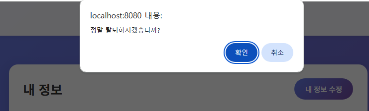

# 🍽️ YumYumE - 당신만을 위한 영양 관리 시스템

> YumYumE는 사용자가 식사를 기록하고, 영양 섭취를 분석하며, 건강한 식습관을 기를 수 있도록 개인화된 피드백을 제공하는 웹 애플리케이션입니다.

## SSAFY Backend 13주차 관통 프로젝트 - Servlet

팀원: 박정훈, 김예성

## 프로젝트 구조

YumYumE/ <br>
├── src/main/java/com/ssafy/yumyume/ <br>
│ ├── constant/ # 상수 (Enum 등, 예: ActivityLevel.java) <br>
│ ├── food/ # 음식 관련 기능 <br>
│ │ ├── controller/ # FoodController.java, ReportController.java <br>
│ │ └── model/ <br>
│ │ ├── dao/ # FoodDao.java, FoodDaoImpl.java, ReportDao.java, ReportDaoImpl.java <br>
│ │ ├── dto/ # FoodDto.java, ReportDto.java, ReportFoodDto.java <br>
│ │ └── service/ # FoodService.java, FoodServiceImpl.java, ReportService.java, ReportServiceImpl.java <br>
│ ├── user/ # 사용자 관련 기능 <br>
│ │ ├── controller/ # UserController.java <br>
│ │ └── model/ <br>
│ │ ├── dao/ # UserDao.java, UserDaoImpl.java <br>
│ │ ├── dto/ # UserDto.java <br>
│ │ └── service/ # UserService.java, UserServiceImpl.java <br>
│ └── util/ # 유틸리티 클래스 <br>
│ ├── ai/ # AiUtil.java (AI API 키 관리) <br>
│ ├── db/ # DbUtil.java (DB 연결 관리) <br>
│ └── helper/ # ControllerHelper.java, ServiceHelper.java (공통 기능 인터페이스) <br>
├── src/main/resources/ <br>
│ └── config.properties # DB 정보, API 키 등 설정 파일 <br>
└── src/main/webapp/ <br>
├── static/ # CSS, JavaScript, 이미지 등 정적 파일 <br>
│ ├── css/ # style.css, food_modal.css 등 <br>
│ └── img/ # 이미지 파일 <br>
├── view/ # JSP 뷰 파일 <br>
│ ├── common/ # header.jsp, footer.jsp <br>
│ ├── food/ # food_detail.jsp, list.jsp (음식 관련) <br>
│ ├── report/ # list.jsp, report.jsp (리포트 관련) <br>
│ └── user/ # login.jsp, mypage.jsp, regist.jsp (유저 관련)<br>
├── WEB-INF/ # 웹 애플리케이션 설정 <br>
│ └── web.xml <br>
└── index.jsp # 메인 페이지 <br>

## ✨ 주요 기능

- **개인 맞춤 기준치 설정:** 회원가입 시 입력한 사용자 프로필 데이터(나이, 성별, 키, 몸무게, 활동 수준)를 기반으로 개인의 일일 권장 영양 섭취량(칼로리, 다량 영양소 등)을 자동으로 계산합니다.
- **음식 데이터베이스:** 다양한 음식 항목을 검색하고 상세 영양 정보를 확인할 수 있습니다.
- **식사 기록:** 사용자는 데이터베이스에서 음식을 선택하고 섭취량(g 또는 ml)을 입력하여 현재 식사(아침, 점심, 저녁, 간식)에 추가할 수 있습니다.
- **영양 분석 및 점수화:** 기록된 식사의 총 영양 성분을 계산하고, 해당 식사 시간에 대한 사용자의 개인 맞춤 기준치와 비교하여 100점 만점의 점수를 생성합니다.
- **AI 기반 피드백:** Upstage AI (Solar Pro 2 모델)와 연동하여, 섭취한 특정 음식까지 고려한 식단 분석 결과를 바탕으로 개인화되고 데이터 기반의 코멘트와 실천 가능한 조언을 제공합니다.
- **리포트 관리:** 각 식사 분석 결과를 리포트로 저장합니다. 사용자는 리포트 기록을 보고, 권장량 대비 상세 영양 분석 내용과 각 리포트에 포함된 음식 목록을 확인할 수 있으며, 리포트를 삭제할 수도 있습니다.

## 🛠️ 기술 스택

- **백엔드:** Java Servlets, JDBC
- **프론트엔드:** JSP, HTML, CSS, JavaScript
- **데이터베이스:** MySQL
- **외부 API:** Upstage AI (Solar Pro 2)
- **서버:** Apache Tomcat
- **아키텍처:** MVC (Model-View-Controller)

## 🚀 시작하기

1.  **데이터베이스 설정:**
    - MySQL 데이터베이스를 준비합니다.
    - yumyume_ver15.sql 파일을 import 합니다.
2.  **환경 설정:**
    - `src/main/resources` 디렉토리에 `config.properties` 파일을 수정합니다.
    - 데이터베이스 연결 정보(`db.driver`, `db.url`, `db.username`, `db.password`)를 추가합니다.
    - Upstage AI API 키(`ai.api.key`)를 추가합니다.
    - **중요:** 민감한 키 정보가 커밋되지 않도록 `.gitignore` 파일에 `/src/main/resources/config.properties`를 추가합니다.
3.  **의존성:**

```
<dependencies>
    <!-- https://mvnrepository.com/artifact/com.mysql/mysql-connector-j -->
    <dependency>
        <groupId>com.mysql</groupId>
        <artifactId>mysql-connector-j</artifactId>
        <version>8.0.33</version>
    </dependency>

    <!-- https://mvnrepository.com/artifact/jakarta.servlet.jsp.jstl/jakarta.servlet.jsp.jstl-api -->
    <dependency>
        <groupId>jakarta.servlet.jsp.jstl</groupId>
        <artifactId>jakarta.servlet.jsp.jstl-api</artifactId>
        <version>3.0.2</version>
    </dependency>

    <!-- https://mvnrepository.com/artifact/org.glassfish.web/jakarta.servlet.jsp.jstl -->
    <dependency>
        <groupId>org.glassfish.web</groupId>
        <artifactId>jakarta.servlet.jsp.jstl</artifactId>
        <version>3.0.1</version>
    </dependency>

    <dependency>
        <groupId>org.mindrot</groupId>
        <artifactId>jbcrypt</artifactId>
        <version>0.4</version>
    </dependency>
</dependencies>
```

## Database ERD

</img>

food 테이블 데이터 출처: [식품의약품안전처](https://various.foodsafetykorea.go.kr/nutrient/general/down/historyList.do)
<br>
가공식품 DB.xlsx (2025-03-31)
<br>
음식 DB.xlsx (2025-04-08)

# 화면 소개

## 메인 화면

### 로그인 전

 </img>

### 로그인 후

</img>

- 단순 소개 및 리다이렉트 페이지

## 회원관련

### 회원 가입 페이지

 </img>

- 아이디는 4~20자가 아니면 재요청

   </img>

- 이미 가입되어있는 아이디면 제외

   </img>

- 비밀번호는 8~20자가 아니면 재요청

   </img>

- 비밀번호 확인 칸과 위의 입력 비밀번호와 일치하지 않다면 재입력 요청

   </img>

- 이후 DB에는 암호화되어 저장 (Bcrypt 모듈 사용)

   </img>

- 나머지 정보들 입력 후 저장

   </img>
   </img>

- 저장되는 영양소 정보들 계산법

   </img>

  - std_weight(표준 몸무게)

    - 성별에 따른 계산 방식
      - 남성 - (본인 키 - 100) \* 0.9 를 소수점 1자리로 반올림
      - 여성 - (본인 키 - 100) \* 0.85 를 소수점 1자리로 반올림

  - std_kcal(표준 칼로리 섭취량)
    - 성별에 따른 계산 공식
    ```math
    \text{표준 칼로리 섭취량}(std\_kcal) =
    \begin{cases}
    \text{남성 =  }(\text{표준 몸무게} \times 10 + \text{본인 몸무게} \times 6.25 - \text{본인 나이} \times 5 + 5) \times \text{활동 계수}\\
    \text{여성 =  }(\text{표준 몸무게} \times 10 + \text{본인 몸무게} \times 6.25 - \text{본인 나이} \times 5 - 161) \times \text{활동 계수}\\
    \end{cases}
    ```
    - 활동 계수
      - SEDENTARY(거의 안함 (운동 안함) = 1.2),
      - LIGHT(가벼운 활동 (주 1~3회) = 1.375),
      - MODERATE(보통 활동 (주 3~5회) = 1.55),
      - ACTIVE(활발한 활동 (주 6~7회) = 1.725),
      - VERY_ACTIVE(매우 활발 (육체노동 or 선수급) = 1.9) 로 구분

  #### 영양소 비율 - 탄수화물 : 단백질 : 지방 : 당 = 6 : 1.4 : 2.2 : 0.4

  ```math
      \text{표준 영양소 섭취량}(g) =
      \begin{cases}
      \text{std\_carb\_g(표준 탄수화물 섭취량, 단위 : g) : }\dfrac{\text{표준 칼로리 섭취량} \times 0.6}{4}\\[1em]
      \text{std\_protein\_g(표준 단백질 섭취량, 단위 : g) : }\dfrac{\text{표준 칼로리 섭취량} \times 0.14}{4}\\[1em]
      \text{std\_fat\_g(표준 지방 섭취량, 단위 : g) : }\dfrac{\text{표준 칼로리 섭취량} \times 0.22}{9}\\[1em]
      \text{std\_sugar\_g(표준 당 섭취량, 단위 : g) : }\dfrac{\text{표준 칼로리 섭취량} \times 0.04}{4}\\[1em]
      \text{std\_natrium\_g(표준 나트륨 섭취량, 단위 : g) : }2
      \end{cases}
  ```

   </img>

### 내 정보 페이지

 </img>

### 내 정보 수정 페이지

 </img>

- 수정된 정보들을 불러옴. 일일 권장 영양소 또한 새로 입력된 정보들을 바탕으로 재계산되어 반영

 </img>

### 회원 탈퇴

 </img>

- 회원 탈퇴 시 DB에서도 데이터 삭제 (id가 yumyum인 데이터 삭제)

 </img>

### 로그인 페이지

 </img>

 </img>

- 아이디 혹은 비밀번호가 틀릴 시 재입력 요청

   </img>

### 아이디 기억하기

 </img>

- 아이디 기억하기 체크 후 로그인 시, 이후 로그인 시도할 때 아이디 유지

   </img>

## 식단 분석

### 로그인 전

</img>

- 음식 추가 버튼 렌더링 X

### 로그인 후

</img>

- 음식 추가 버튼 렌더링 O
- 음식 이름 또는 카테고리 검색(동시 가능)
- 페이지네이션
- 담은 음식 보기 버튼

### 음식 추가

</img>

- 섭취한 음식 중량 입력
  - 입력에 따라 영양소량 변경 (기준량 100g또는ml)

### 담은 음식 리스트

</img>

- 식사 타입 선택 (아침/점심/저녁/간식)
  - 점수 산출에 영향 O
- 담은 음식들 중량에 따른 영양소
- 모든 음식들의 총합 제공

### 리포트 리스트

</img>

- 유저별 생성한 리포트 리스트
- 점수 및 간단한 평가, 총합 요약
- 클릭시 상세보기

### 리포트 상세보기

</img>
</img>

- 영양 점수 및 식사 타입 표시
  - 영양 점수 = (각 영양소별 점수 \* 가중 비율) 총합
  - 영양소별 점수 산출 방법
    - 영양소별 한 끼 권장량 = 일일 권장량 / 식사 타입
    - 식사 타입 => (아침, 점심, 저녁) = 3, 간식 = 6
  - 각 영양소별 점수 산출 (당류는 낮을수록 높은 점수)
    - 비율 $R = \frac{\text{섭취한 양}}{\text{권장량}}$
```math
\text{점수}(R) =
\begin{cases}
100 & \text{if } 0.9 \le R \le 1.1 \\
90 + (R - 0.8) \times 100 & \text{if } 0.8 \le R < 0.9 \\
90 + (1.2 - R) \times 100 & \text{if } 1.1 < R \le 1.2 \\
80 + (R - 0.7) \times 100 & \text{if } 0.7 \le R < 0.8 \\
80 + (1.3 - R) \times 100 & \text{if } 1.2 < R \le 1.3 \\
70 + (R - 0.6) \times 100 & \text{if } 0.6 < R < 0.7 \\
70 + (1.4 - R) \times 100 & \text{if } 1.3 < R \le 1.4 \\
\max(0, 70 - (R - 1.4) \times 100) & \text{if } R > 1.4 \\
\max(0, 70 - (0.6 - R) \times 100) & \text{if } R \le 0.6
\end{cases}
```
```math
\text{점수}_{\text{당류}}(R) =
\begin{cases}
100 & \text{if } R \le 1.0 \\
90 + (1.2 - R) \times 50 & \text{if } 1.0 < R \le 1.2 \\
80 + (1.4 - R) \times 50 & \text{if } 1.2 < R \le 1.4 \\
\max(0, 80 - (R - 1.4) \times 100) & \text{if } R > 1.4
\end{cases}
```
    
  - 영양소별 가중치
    - 칼로리 (0.3)
    - 탄수화물 (0.2)
    - 단백질 (0.25)
    - 지방 (0.15)
    - 당 (0.1)
  - 나트륨은 점수에서 제외
- 식단의 음식 리스트 (토글 가능)
- 영양소별 권장 섭취량 퍼센티지
  - 섭취량 / 한 끼 권장량
- 선택한 식단에 대한 AI 코멘트
  - Upstage AI Solar Pro2 모델 API 사용
  - 전달 프롬프트
  ```
  "당신은 데이터 기반 영양 코치 'YumYumE'입니다.
  사용자의 식단 데이터를 꼼꼼하게 분석하세요. 특히 사용자가 먹은 'foods' 목록에 주의를 기울이세요: 'inputData'
  도움이 되고 객관적인 톤으로 2~3 문장 이내의 피드백을 *한국어*로 제공하세요.
  다음 규칙을 엄격히 따르세요:
  1. 각 영양소의 'actual'(섭취량)과 'standard'(권장량) 비율을 분석하고, 섭취한 'foods'의 기여도를 고려하세요.
  2. 특정 영양소가 현저히 높거나(예: 140% 초과) 낮다면(예: 60% 미만), *반드시* 가장 두드러진 문제를 지적하세요. 가능하다면 어떤 음식(들)이 불균형의 원인이 되었는지 간략히 언급하세요(예: '고구마를 드셨지만 탄수화물이 조금 부족했네요.' 또는 '팝콘 때문에 나트륨이 다소 높았을 수 있어요.'). '든든한 식사였어요.' 같은 모호한 표현 대신 구체적으로 지적해야 합니다.
  3. 대부분의 영양소가 잘 균형 잡혀 있다면(예: 90% ~ 110% 사이), 선택한 음식들로 좋은 균형을 이룬 점을 언급하며 긍정적인 코멘트를 하세요.
  4. 분석 결과와 섭취한 음식을 바탕으로, 사용자의 다음 식사를 위한 간단하고 실천 가능한 팁을 특정 음식 종류를 포함하여 제안하세요(예: '다음 식사에는 잎채소를 추가해 비타민을 보충하면 좋겠어요.').
  중요: *오직* 순수한 한국어 텍스트로만 응답하세요. 자연스러운 문장 흐름을 사용하세요.
  영어, 인용 부호(\"), 괄호 안의 설명(), 목록 형식(1., 2. 등)은 절대 포함하지 마세요."
  ```
  - inputData
    - 현재 식단의 음식 목록 및 중량
    - 리포트 생성 당시 회원의 섭취 권장량
    - 식단의 영양소 섭취량
